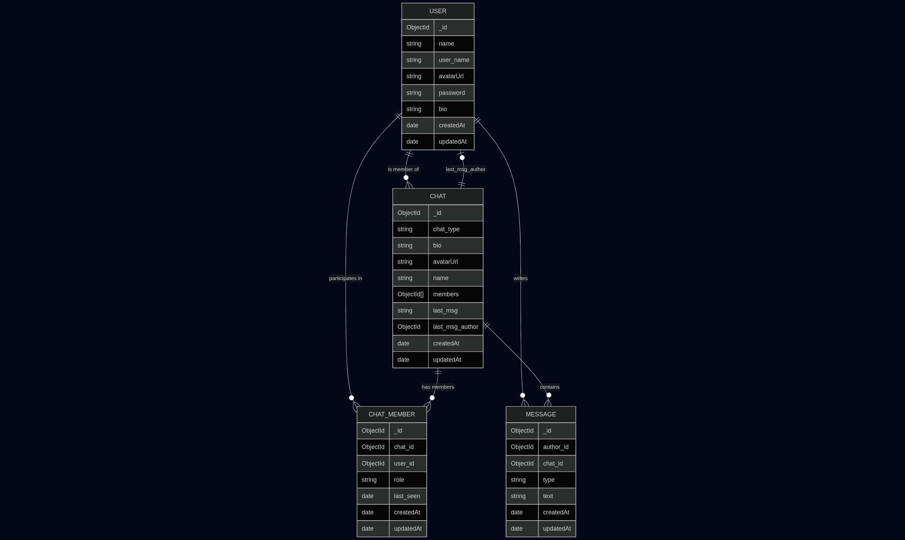
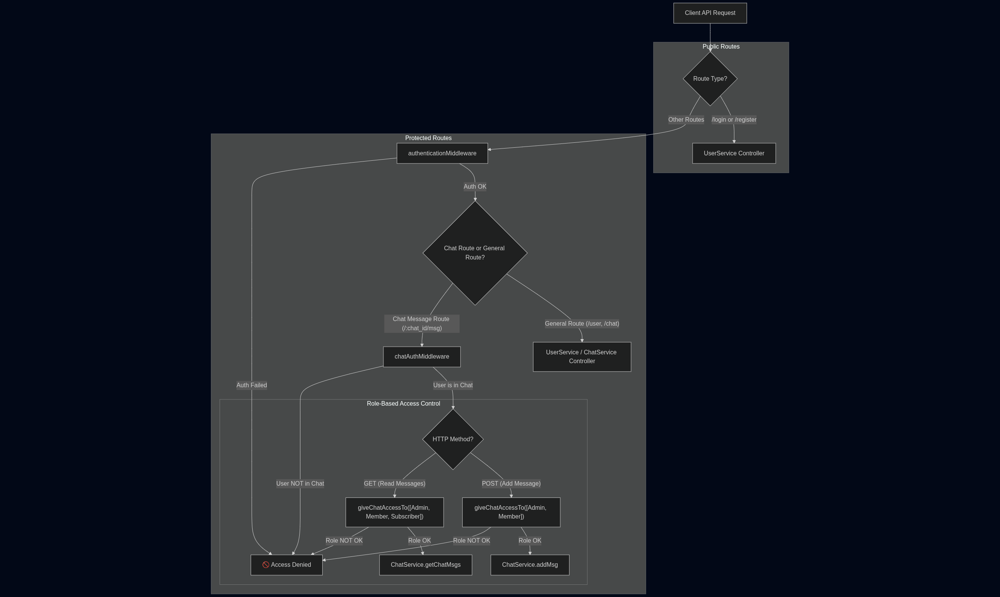

# 💬 CHAT-APP-MERN

A full-stack real-time chat application built with the **MERN** stack.

This project leverages modern web development technologies with an emphasis on type-safety, modularity, and real-time performance.

> ⚠️ Currently, **group chat is not implemented**, but the schema has been designed to support it in future extensions.

## 🛠️ Tech Stack

### Backend
- **Express** (generated via [express-typescript-generator](https://www.npmjs.com/package/express-typescript-generator))
- **TypeScript**
- **Mongoose** (MongoDB ORM)
- **JWT + bcryptjs** (Authentication and password hashing)
- **Socket.io** (Real-time chat support)
- **Jet-logger** (Structured logging)

### Frontend
- **React** (via **Vite**)
- **TypeScript**
- **shadcn/ui** + **TailwindCSS** (Component and utility-first styling)
- **Context API** (Global state management)
- **Sonner** (Centralized toast notifications)
- **Axios** (Centralized API communication)

---

## 📊 System Architecture

### ER Diagram



### Middleware Structure



---

## ⚙️ Environment Variables

### 🌐 Common
```env
NODE_ENV=development

PORT=3079
HOST=localhost

JET_LOGGER_MODE=CONSOLE
JET_LOGGER_FILEPATH=jet-logger.log
JET_LOGGER_TIMESTAMP=TRUE
JET_LOGGER_FORMAT=LINE

MONGO_URL=mongodb://127.0.0.1:27017/tudo-CHATAPP
JWT_SECRET=AVeryRandomString
CLIENT_URL=http://localhost:5173
```


## 🔌 Socket.IO Architecture

- Each **online user** is assigned a **unique socket room** upon connection.
- After a new message is inserted into the chat:
  - The server fetches all **chat members** associated with that chat.
  - The message is then emitted individually to each member’s room using `socket.to(userId).emit(...)`.
- This ensures:
  - Real-time message delivery
  - Isolation between users
  - Scalability for both private and future group chats

> 🔄 Group chat is **not yet implemented**, but the current schema is designed with group messaging in mind.

---

## 🚀 Getting Started

1. Clone the repository:
   ```bash
   git clone https://github.com/siddhant-deshmukh/CHAT-APP-MERN/
   ```
2. Frontend setup:
  ```bash
  cd frontend

  npm install
  
  npm run build
  npm run preview
  # or simply start in development mode
  npm run dev
  ```
3. Backend setup:
  ```bash
  cd backend
  npm install
  npm run build
  npm start
  ```


